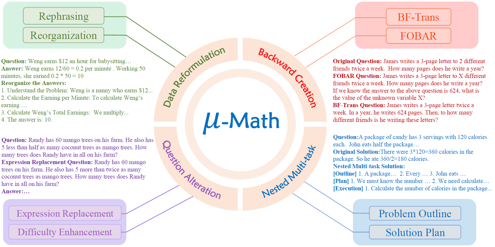

# MuMath: Multi-perspective Data Augmentation for Mathematical Reasoning in Large Language Models

## Introduction

We have amalgamated and further refined these strengths while broadening the scope of augmentation methods to construct a multi-perspective augmentation dataset for mathematics—termed [MuMath (μ-Math) Dataset](https://huggingface.co/datasets/weihao1/MuMath). Subsequently, we finetune LLaMA-2 on the MuMath dataset to derive the MuMath model.


| Model | Size | GSM8k | MATH |
|---|---|---|---|
| WizardMath-7B | 7B | 54.9 | 10.7 |
| MetaMath-7B | 7B | 66.3 | 19.7 |
| MuggleMath-7B | 7B | 68.4 | - |
| [MuMath-7B](https://huggingface.co/weihao1/MuMath-7B) | 7B | **79.1** | **30.0** |
||
| WizardMath-13B | 13B | 63.9 | 14 |
| MetaMath-13B | 13B | 72.3 | 22.4 |
| MuggleMath-13B | 13B | 74 | - |s
| [MuMath-13B](https://huggingface.co/weihao1/MuMath-13B) | 13B | **83.6** | **33.3** |
||
| WizardMath-70B | 70B | 81.6 | 22.7 |
| MetaMath-70B | 70B | 82.3 | 26.6 |
| MuggleMath-70B | 70B | 82.3 | - |
| [MuMath-70B](https://huggingface.co/weihao1/MuMath-70B) | 70B | **88.5** | **41.2** |

> The best results are bolded.


## Augmentation Methods 
<p align="center">
    
    <br>
    <em>Overview of the augmentation methods our MuMath employs, which can be divided into four categories: (1) Data Reformulation includes solution reorganization and question rephrasing; (2) Backward Creation includes Backward-Forward Transformation (BF-Trans) and FOBAR; (3) Question Alteration includes expression replacement and difficulty enhancement; (4) Nested Multi-task construction includes data of the auxiliary tasks, i.e., Problem Outline and Solution Plan.</em>
</p>


### Setup

We recommend using [Conda](https://docs.conda.io/projects/miniconda) to manage your environment. We use [vLLM](https://github.com/vllm-project/vllm) to accelerate inference. Run the following commands to setup your environment:

```sh
conda create -n mumath python=3.10 
conda activate mumath
cd MuMath-src 
pip install -r requirements.txt 
```


## Training 

We also open [MuMath Dataset](https://huggingface.co/datasets/weihao1/MuMath) for the training stage.

To train a model, after specifying `MODEL_PATH`, `SAVE_PATH`, `DATA_PATH`, the conda environment and so on, run the following command:

```sh

# 7B or 13B 
bash train_7b.sh 

# 34B 
bash train_13b_70b.sh 

```

### Inference and Evaluation 

We provide scripts for inference and evaluation, which are called in `train_7b.sh` and `train_13b_70b.sh` as mentioned above.

```sh
python eval_gsm8k.py --model $SAVE_PATH --data_file ./data/test/GSM8K_test.jsonl 
python eval_math.py --model $SAVE_PATH --data_path ./data/test/MATH_test.jsonl 
```

## Citation 
Please cite the paper if you refer to our model, code, data or paper from MuMath.

```
@inproceedings{you-etal-2024-mumath,
    title = "{M}u{M}ath: Multi-perspective Data Augmentation for Mathematical Reasoning in Large Language Models",
    author = "You, Weihao  and Yin, Shuo  and Zhao, Xudong  and Ji, Zhilong  and Zhong, Guoqiang  and Bai, Jinfeng",
    booktitle = "Findings of the Association for Computational Linguistics: NAACL 2024",
    month = jun,
    year = "2024",
    pages = "2932--2958",
}
```

## Credits

This project has adopted the [MeteMath](https://github.com/meta-math/MetaMath) and [MuggleMath](https://github.com/OFA-Sys/gsm8k-ScRel).

